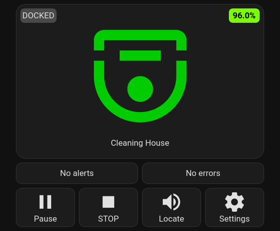
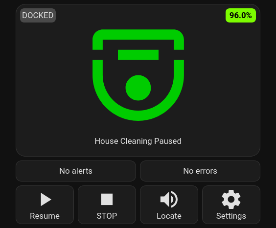
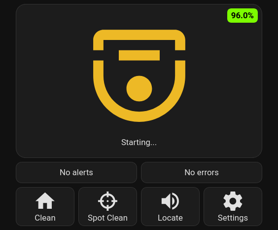
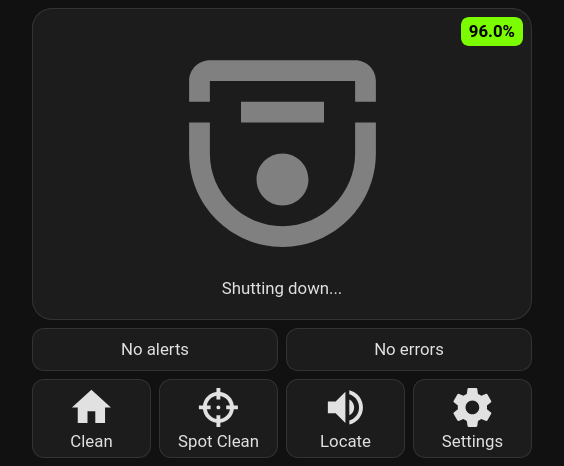
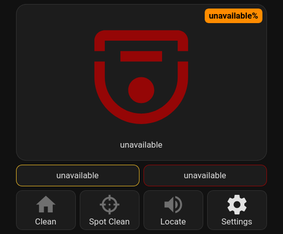
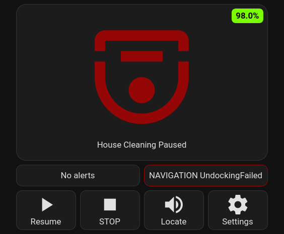
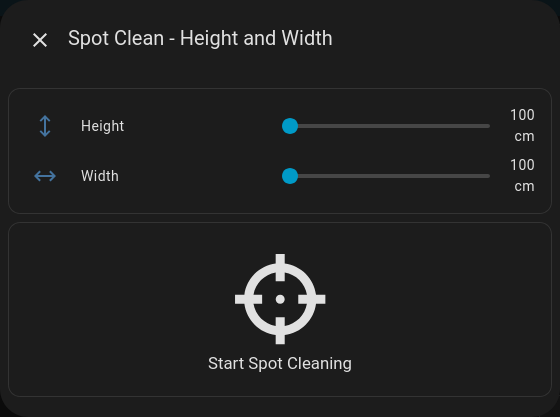

## Home Assistant card

Cleaning running | Cleaning paused
:-------------------------:|:-------------------------:
 |  

Booting | Shutting down
:-------------------------:|:-------------------------:
 |   

Disconnected | Alert | Error
:-------------------------:|:-------------------------:|:----
 |   |  

## Webserver interface
If you want, you can also control the robot via the esphome webserver interface, this just shows all settings, the log and the buttons to do actions.

